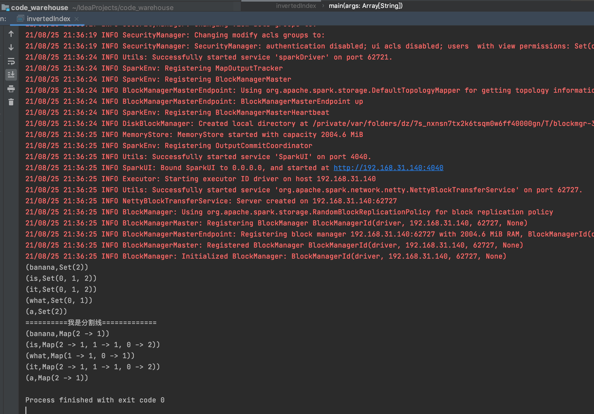
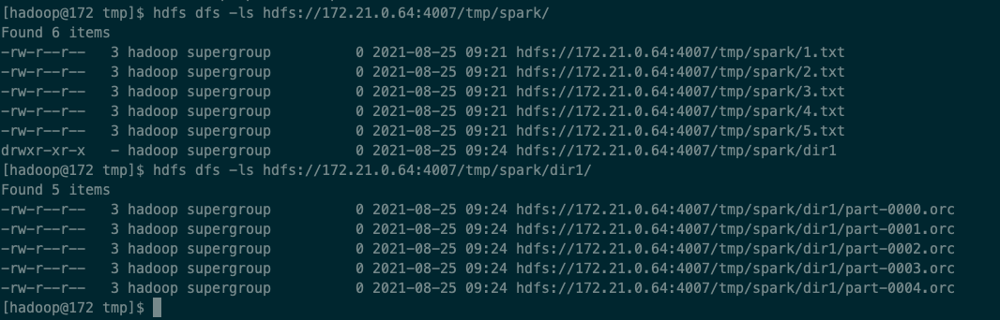
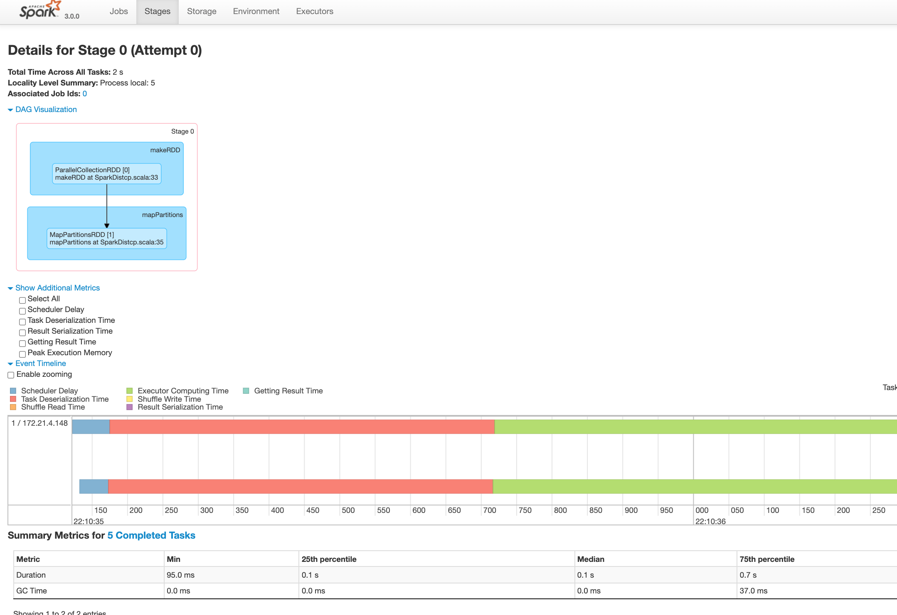
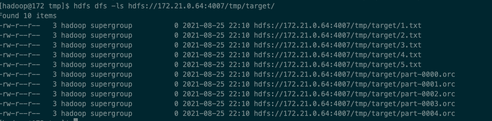

## 作业一
```scala
package rdd

import org.apache.hadoop.io.{LongWritable, Text}
import org.apache.hadoop.mapred.{FileSplit, InputSplit, TextInputFormat}
import org.apache.log4j.Logger
import org.apache.spark.internal.Logging
import org.apache.spark.rdd.{NewHadoopRDD, RDD}
import org.apache.spark.sql.SparkSession

/**
 * @author Congpeixin
 * @date 2021/8/21 10:54 下午
 * @version 1.0
 * @describe
 */
object invertedIndex extends Logging {
  def main(args: Array[String]): Unit = {
    val spark = SparkSession.builder().appName("invertedIndex").master("local[2]").getOrCreate()
    spark.sparkContext.setLogLevel("ERROR")
    val filePath = "/Users/dongqiudi/IdeaProjects/code_warehouse/spark_core/src/main/scala/rdd/data/"
    // 读取多个文件，并附有文件名
    val originalRDD: RDD[(String, String)] = spark.sparkContext.wholeTextFiles(filePath)

    // 1. 文件内容单词切分、压扁
    // 2. 单词与文件名对应
    // eg. (it,0)
    //     (it,2)
    //     (is,0)
    //     (is,2)
    //     (what,0)
    //     (a,2)
    //     (banana,2)
    //     (it,0)
    val wordInFileNameRDD = originalRDD.flatMap(line => {
      val fileName = line._1
      val wordArray = line._2.replace("\"", "").split(" ")
      wordArray.map((_, fileName.replace("file:" + filePath, "")))
    })

    // groupByKey分组，将单词对应的文件名放到一个组中
    // 结果一：
    //     反向文件索引：
    //     "a": {2}
    //     "banana": {2}
    val res1RDD = wordInFileNameRDD.groupByKey().map(kv => (kv._1, kv._2.toSet))
    res1RDD.foreach(println)

    println("==========我是分割线=============")

    // (it,0) -> mapValues (it,(0,1)) , (it,(0,1)) -> groupByKey -> (it,CompactBuffer((0,1), (0,1), (1,1), (2,1)))
    // (it,CompactBuffer((0,1), (0,1), (1,1), (2,1))) -> map(groupBy(CompactBuffer.element(_.1))) -> reduce 聚合
    // 结果二：
    //  "a": {(2,1)}
    //  "banana": {(2,1)}
    //  "is": {(0,2), (1,1), (2,1)}
    //  "it": {(0,2), (1,1), (2,1)}
    val res2RDD = wordInFileNameRDD.mapValues((_, 1)).groupByKey().map(kv => {
      val stringToTuples = kv._2.toSeq.groupBy(line => line._1).map(line => {
        val fileName = line._1
        val count = line._2.reduce((a, b) => (a._1, (a._2 + b._2)))._2
        (fileName, count)
      })
      (kv._1, stringToTuples)
    })
    res2RDD.foreach(println)
  }

}
```
运行结果



## 作业二
```shell
spark-submit --master yarn --deploy-mode client  --queue bigdatauser --executor-memory 4G --num-executors 2 --executor-cores 2 --driver-memory 4g --class com.dongqiudi.userprofile.SparkDistcp spark-userprofile-1.0-SNAPSHOT.jar hdfs://172.21.0.64:4007/tmp/spark hdfs://172.21.0.64:4007/tmp/target
```

```scala
package com.dongqiudi.userprofile

import org.apache.hadoop.conf.Configuration
import org.apache.hadoop.fs.{FileSystem, FileUtil, Path}
import org.apache.spark.sql.SparkSession

import java.net.URI
import scala.collection.convert.ImplicitConversions.`collection AsScalaIterable`

/**
 * @author Congpeixin
 * @date 2021/8/24 6:31 下午
 * @version 1.0
 * @describe
 */
object SparkDistcp {
  def main(args: Array[String]): Unit = {

    val sourcePath = args(0)
    val targetPath = args(1)

    val source = sourcePath.substring(sourcePath.lastIndexOf(":") + 5)
    val target = targetPath.substring(targetPath.lastIndexOf(":") + 5)
    val domain = sourcePath.substring(0, sourcePath.lastIndexOf(":") + 5)

    val spark = SparkSession.builder().appName("SparkDistcp").getOrCreate()
    val hdfsUtil: HDFSFileUtil = new HDFSFileUtil()

    // source目录下文件列表
    val hdfsFilesList = hdfsUtil.listHdfsFiles(domain, source)
    // 根据source目录下文件列表创建RDD
    val hdfsFilesRDD = spark.sparkContext.makeRDD(hdfsFilesList.toSeq, 5)

    hdfsFilesRDD.mapPartitions(partition => {
      partition.map(path => {
        val fileSystem = FileSystem.get(new URI(domain), new Configuration)
        // 文件拷贝
        FileUtil.copy(fileSystem, new Path(path.replace(domain, "")), fileSystem, new Path(target), false, new Configuration)
      })
    }).collect()
    spark.close()
  }
}
```

```java
import org.apache.commons.io.IOUtils;
import org.apache.hadoop.conf.Configuration;
import org.apache.hadoop.fs.*;

import java.io.File;
import java.io.FileOutputStream;
import java.io.IOException;
import java.io.InputStream;
import java.net.URI;
import java.net.URISyntaxException;
import java.net.URL;
import java.util.ArrayList;

/**
 * @author Congpeixin
 * @version 1.0
 * @date 2021/8/24 6:54 下午
 * @describe
 */
public class HDFSFileUtil {
    /**
     * 遍历hdfs上面所有的文件
     */
    public ArrayList<String> listHdfsFiles(String hdfsDomain, String sourcePath) throws  Exception{
        FileSystem fileSystem = FileSystem.get(new URI(hdfsDomain), new Configuration());
        ArrayList<String> hdfsFilesList = new ArrayList<>();
        Path path = new Path(sourcePath);
        //alt  +  shift  +  l  提取变量
        RemoteIterator<LocatedFileStatus> locatedFileStatusRemoteIterator = fileSystem.listFiles(path, true);
        //遍历迭代器，获取我们的迭代器里面每一个元素
        while (locatedFileStatusRemoteIterator.hasNext()){
            LocatedFileStatus next = locatedFileStatusRemoteIterator.next();
            Path path1 = next.getPath();
            System.out.println(path1.toString());
            hdfsFilesList.add(path1.toString());
        }
//        fileSystem.close();
        return hdfsFilesList;
    }

}
```
### source file


### spark job


### target file
