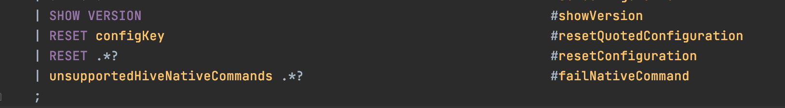
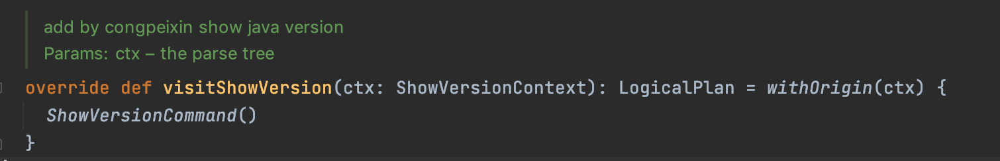
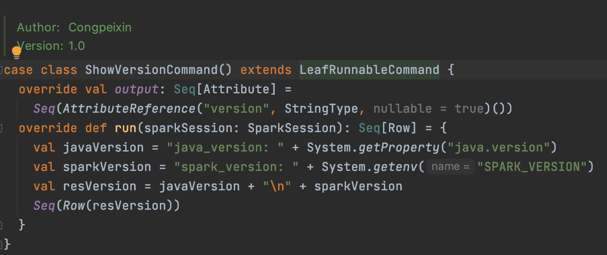
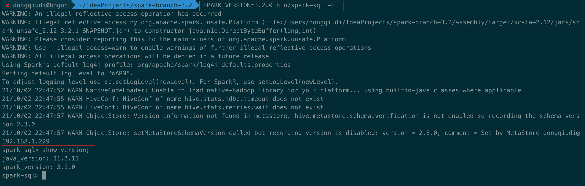
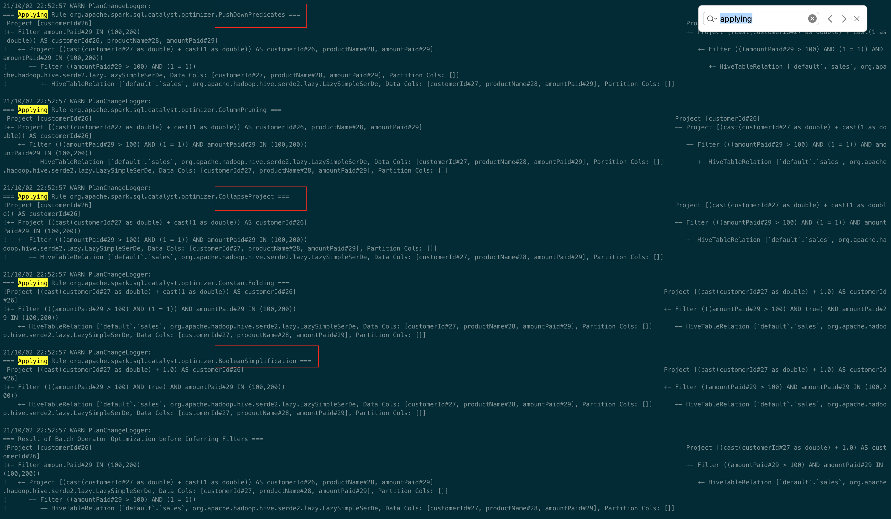
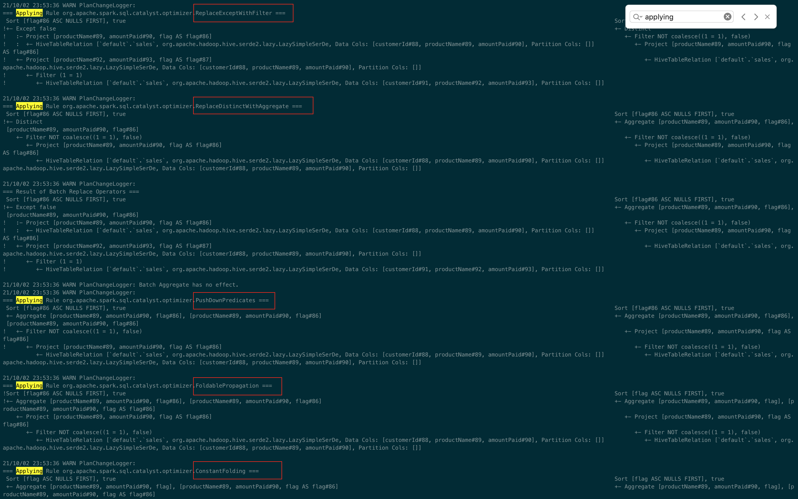
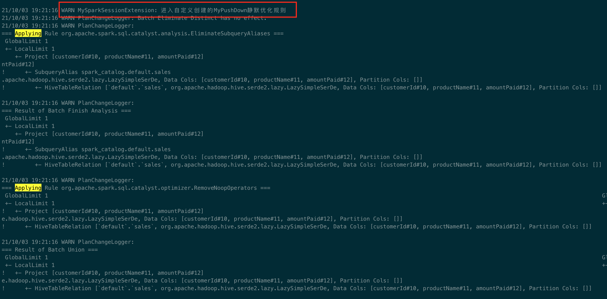

## 1. 为Spark SQL添加一条自定义命令
实现 SHOW VERSION; 显示当前Spark版本和Java版本

步骤一： 修改 sqlBase.g4文件，并且编译antlr插件


步骤二：SparkSQLParser添加visit方法


步骤三：创建Command


最后编译整个源码，运行



## 2.构建SQL满足如下要求

1. 构建一条SQL，同时apply下面三条优化规则：
   - CombineFilters
   - CollapseProject
   - BooleanSimplification

SQL：
```sql
select customerId from (
select customerId+1 as customerId, productName, amountPaid from sales where amountPaid > 100 and 1=1
) t_tmp where t_tmp.amountPaid in (100,200);
```
遍历应用到的优化规则



2. 构建一条SQL，同时apply下面五条优化规则：
   - ConstantFolding
   - PushDownPredicates
   - ReplaceDistinctWithAggregate
   - ReplaceExceptWithAntiJoin
   - FoldablePropagation
   
SQL:
```sql
SELECT productName, amountPaid, 'flag' flag from sales EXCEPT select productName, amountPaid, 'flag' as flag from sales where 1=1 order by 3;
```
遍历应用到的优化规则


## 3. 实现自定义优化规则（静默规则）
自定义优化规则代码
```scala
/**
 * @author Congpeixin
 * @date 2021/10/3 19:14 下午
 * @version 1.0
 * @describe
 */
import org.apache.spark.internal.Logging
import org.apache.spark.sql.{SparkSession, SparkSessionExtensions}
import org.apache.spark.sql.catalyst.plans.logical.LogicalPlan
import org.apache.spark.sql.catalyst.rules.Rule


case class MyPushDown(spark: SparkSession) extends Rule[LogicalPlan] with Logging{
  def apply(plan: LogicalPlan): LogicalPlan = plan
}

class MySparkSessionExtension extends (SparkSessionExtensions => Unit) with Logging{
  override def apply(extensions: SparkSessionExtensions): Unit = {
//    logInfo("进入自定义创建的MyPushDown静默优化规则-1")
    extensions.injectOptimizerRule { session =>
      logWarning("进入自定义创建的MyPushDown静默优化规则")
      new MyPushDown(session)
    }
  }
}
```
静默规则截图



