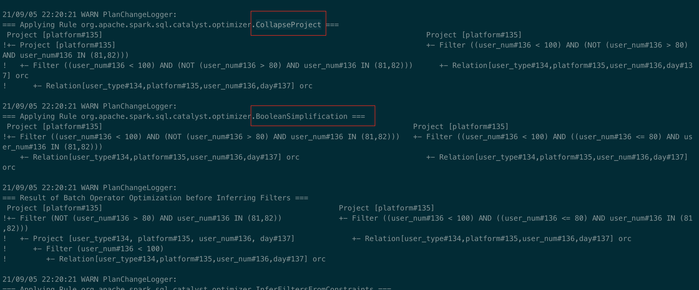

## 1. show version


## 2.构建SQL满足如下要求

1. 通过set spark.sql.planChangeLog.level=WARN;查看1. 构建一条SQL，同时apply下面三条优化规则：CombineFiltersCollapseProjectBooleanSimplification

```sql
select platform from (select * from ads_dqd_dau_user where user_num < 100)a where user_num in (81,82);
```
```shell
select platform from (select * from ads_dqd_dau_user where user_num < 100)a where !(user_num > 80) and user_num in (81,82);
21/09/05 22:20:20 WARN PlanChangeLogger: Batch Substitution has no effect.
21/09/05 22:20:20 WARN PlanChangeLogger: Batch Disable Hints has no effect.
21/09/05 22:20:20 WARN PlanChangeLogger: Batch Hints has no effect.
21/09/05 22:20:20 WARN PlanChangeLogger: Batch Simple Sanity Check has no effect.
21/09/05 22:20:21 WARN PlanChangeLogger:
=== Applying Rule org.apache.spark.sql.catalyst.analysis.Analyzer$ResolveRelations ===
 'Project ['platform]                                               'Project ['platform]
 +- 'Filter (NOT ('user_num > 80) AND 'user_num IN (81,82))         +- 'Filter (NOT ('user_num > 80) AND 'user_num IN (81,82))
    +- 'SubqueryAlias a                                                +- 'SubqueryAlias a
       +- 'Project [*]                                                    +- 'Project [*]
          +- 'Filter ('user_num < 100)                                       +- 'Filter ('user_num < 100)
!            +- 'UnresolvedRelation [ads_dqd_dau_user], [], false               +- 'SubqueryAlias spark_catalog.default.ads_dqd_dau_user
!                                                                                  +- 'UnresolvedCatalogRelation `default`.`ads_dqd_dau_user`, org.apache.hadoop.hive.ql.io.orc.OrcSerde, [], false

21/09/05 22:20:21 WARN PlanChangeLogger:
=== Applying Rule org.apache.spark.sql.execution.datasources.FindDataSourceTable ===
 'Project ['platform]                                                                                                              'Project ['platform]
 +- 'Filter (NOT ('user_num > 80) AND 'user_num IN (81,82))                                                                        +- 'Filter (NOT ('user_num > 80) AND 'user_num IN (81,82))
    +- 'SubqueryAlias a                                                                                                               +- 'SubqueryAlias a
       +- 'Project [*]                                                                                                                   +- 'Project [*]
          +- 'Filter ('user_num < 100)                                                                                                      +- 'Filter ('user_num < 100)
!            +- 'SubqueryAlias spark_catalog.default.ads_dqd_dau_user                                                                          +- SubqueryAlias spark_catalog.default.ads_dqd_dau_user
!               +- 'UnresolvedCatalogRelation `default`.`ads_dqd_dau_user`, org.apache.hadoop.hive.ql.io.orc.OrcSerde, [], false                  +- HiveTableRelation [`default`.`ads_dqd_dau_user`, org.apache.hadoop.hive.ql.io.orc.OrcSerde, Data Cols: [user_type#134, platform#135, user_num#136], Partition Cols: [day#137]]

21/09/05 22:20:21 WARN PlanChangeLogger:
=== Applying Rule org.apache.spark.sql.catalyst.analysis.Analyzer$ResolveReferences ===
!'Project ['platform]                                                                                                                                                                               Project [platform#135]
!+- 'Filter (NOT ('user_num > 80) AND 'user_num IN (81,82))                                                                                                                                         +- Filter (NOT (user_num#136 > 80) AND user_num#136 IN (81,82))
!   +- 'SubqueryAlias a                                                                                                                                                                                +- SubqueryAlias a
!      +- 'Project [*]                                                                                                                                                                                    +- Project [user_type#134, platform#135, user_num#136, day#137]
!         +- 'Filter ('user_num < 100)                                                                                                                                                                       +- Filter (user_num#136 < 100)
             +- SubqueryAlias spark_catalog.default.ads_dqd_dau_user                                                                                                                                            +- SubqueryAlias spark_catalog.default.ads_dqd_dau_user
                +- HiveTableRelation [`default`.`ads_dqd_dau_user`, org.apache.hadoop.hive.ql.io.orc.OrcSerde, Data Cols: [user_type#134, platform#135, user_num#136], Partition Cols: [day#137]]                  +- HiveTableRelation [`default`.`ads_dqd_dau_user`, org.apache.hadoop.hive.ql.io.orc.OrcSerde, Data Cols: [user_type#134, platform#135, user_num#136], Partition Cols: [day#137]]

21/09/05 22:20:21 WARN PlanChangeLogger:
=== Result of Batch Resolution ===
!'Project ['platform]                                               Project [platform#135]
!+- 'Filter (NOT ('user_num > 80) AND 'user_num IN (81,82))         +- Filter (NOT (user_num#136 > 80) AND user_num#136 IN (81,82))
!   +- 'SubqueryAlias a                                                +- SubqueryAlias a
!      +- 'Project [*]                                                    +- Project [user_type#134, platform#135, user_num#136, day#137]
!         +- 'Filter ('user_num < 100)                                       +- Filter (user_num#136 < 100)
!            +- 'UnresolvedRelation [ads_dqd_dau_user], [], false               +- SubqueryAlias spark_catalog.default.ads_dqd_dau_user
!                                                                                  +- HiveTableRelation [`default`.`ads_dqd_dau_user`, org.apache.hadoop.hive.ql.io.orc.OrcSerde, Data Cols: [user_type#134, platform#135, user_num#136], Partition Cols: [day#137]]

21/09/05 22:20:21 WARN PlanChangeLogger: Batch Apply Char Padding has no effect.
21/09/05 22:20:21 WARN PlanChangeLogger:
=== Applying Rule org.apache.spark.sql.hive.DetermineTableStats ===
 Project [platform#135]                                                                                                                                                                             Project [platform#135]
 +- Filter (NOT (user_num#136 > 80) AND user_num#136 IN (81,82))                                                                                                                                    +- Filter (NOT (user_num#136 > 80) AND user_num#136 IN (81,82))
    +- SubqueryAlias a                                                                                                                                                                                 +- SubqueryAlias a
       +- Project [user_type#134, platform#135, user_num#136, day#137]                                                                                                                                    +- Project [user_type#134, platform#135, user_num#136, day#137]
          +- Filter (user_num#136 < 100)                                                                                                                                                                     +- Filter (user_num#136 < 100)
             +- SubqueryAlias spark_catalog.default.ads_dqd_dau_user                                                                                                                                            +- SubqueryAlias spark_catalog.default.ads_dqd_dau_user
                +- HiveTableRelation [`default`.`ads_dqd_dau_user`, org.apache.hadoop.hive.ql.io.orc.OrcSerde, Data Cols: [user_type#134, platform#135, user_num#136], Partition Cols: [day#137]]                  +- HiveTableRelation [`default`.`ads_dqd_dau_user`, org.apache.hadoop.hive.ql.io.orc.OrcSerde, Data Cols: [user_type#134, platform#135, user_num#136], Partition Cols: [day#137]]

21/09/05 22:20:21 WARN PlanChangeLogger:
=== Applying Rule org.apache.spark.sql.hive.RelationConversions ===
 Project [platform#135]                                                                                                                                                                             Project [platform#135]
 +- Filter (NOT (user_num#136 > 80) AND user_num#136 IN (81,82))                                                                                                                                    +- Filter (NOT (user_num#136 > 80) AND user_num#136 IN (81,82))
    +- SubqueryAlias a                                                                                                                                                                                 +- SubqueryAlias a
       +- Project [user_type#134, platform#135, user_num#136, day#137]                                                                                                                                    +- Project [user_type#134, platform#135, user_num#136, day#137]
          +- Filter (user_num#136 < 100)                                                                                                                                                                     +- Filter (user_num#136 < 100)
             +- SubqueryAlias spark_catalog.default.ads_dqd_dau_user                                                                                                                                            +- SubqueryAlias spark_catalog.default.ads_dqd_dau_user
!               +- HiveTableRelation [`default`.`ads_dqd_dau_user`, org.apache.hadoop.hive.ql.io.orc.OrcSerde, Data Cols: [user_type#134, platform#135, user_num#136], Partition Cols: [day#137]]                  +- Relation[user_type#134,platform#135,user_num#136,day#137] orc

21/09/05 22:20:21 WARN PlanChangeLogger:
=== Result of Batch Post-Hoc Resolution ===
 Project [platform#135]                                                                                                                                                                             Project [platform#135]
 +- Filter (NOT (user_num#136 > 80) AND user_num#136 IN (81,82))                                                                                                                                    +- Filter (NOT (user_num#136 > 80) AND user_num#136 IN (81,82))
    +- SubqueryAlias a                                                                                                                                                                                 +- SubqueryAlias a
       +- Project [user_type#134, platform#135, user_num#136, day#137]                                                                                                                                    +- Project [user_type#134, platform#135, user_num#136, day#137]
          +- Filter (user_num#136 < 100)                                                                                                                                                                     +- Filter (user_num#136 < 100)
             +- SubqueryAlias spark_catalog.default.ads_dqd_dau_user                                                                                                                                            +- SubqueryAlias spark_catalog.default.ads_dqd_dau_user
!               +- HiveTableRelation [`default`.`ads_dqd_dau_user`, org.apache.hadoop.hive.ql.io.orc.OrcSerde, Data Cols: [user_type#134, platform#135, user_num#136], Partition Cols: [day#137]]                  +- Relation[user_type#134,platform#135,user_num#136,day#137] orc

21/09/05 22:20:21 WARN PlanChangeLogger: Batch Normalize Alter Table has no effect.
21/09/05 22:20:21 WARN PlanChangeLogger: Batch Remove Unresolved Hints has no effect.
21/09/05 22:20:21 WARN PlanChangeLogger: Batch Nondeterministic has no effect.
21/09/05 22:20:21 WARN PlanChangeLogger: Batch UDF has no effect.
21/09/05 22:20:21 WARN PlanChangeLogger: Batch UpdateNullability has no effect.
21/09/05 22:20:21 WARN PlanChangeLogger: Batch Subquery has no effect.
21/09/05 22:20:21 WARN PlanChangeLogger: Batch Cleanup has no effect.
21/09/05 22:20:21 WARN PlanChangeLogger:
=== Metrics of Executed Rules ===
Total number of runs: 218
Total time: 0.152119774 seconds
Total number of effective runs: 5
Total time of effective runs: 0.11651257 seconds

21/09/05 22:20:21 WARN PlanChangeLogger: Batch Eliminate Distinct has no effect.
21/09/05 22:20:21 WARN PlanChangeLogger:
=== Applying Rule org.apache.spark.sql.catalyst.analysis.EliminateSubqueryAliases ===
 Project [platform#135]                                                            Project [platform#135]
 +- Filter (NOT (user_num#136 > 80) AND user_num#136 IN (81,82))                   +- Filter (NOT (user_num#136 > 80) AND user_num#136 IN (81,82))
!   +- SubqueryAlias a                                                                +- Project [user_type#134, platform#135, user_num#136, day#137]
!      +- Project [user_type#134, platform#135, user_num#136, day#137]                   +- Filter (user_num#136 < 100)
!         +- Filter (user_num#136 < 100)                                                    +- Relation[user_type#134,platform#135,user_num#136,day#137] orc
!            +- SubqueryAlias spark_catalog.default.ads_dqd_dau_user
!               +- Relation[user_type#134,platform#135,user_num#136,day#137] orc

21/09/05 22:20:21 WARN PlanChangeLogger:
=== Result of Batch Finish Analysis ===
 Project [platform#135]                                                            Project [platform#135]
 +- Filter (NOT (user_num#136 > 80) AND user_num#136 IN (81,82))                   +- Filter (NOT (user_num#136 > 80) AND user_num#136 IN (81,82))
!   +- SubqueryAlias a                                                                +- Project [user_type#134, platform#135, user_num#136, day#137]
!      +- Project [user_type#134, platform#135, user_num#136, day#137]                   +- Filter (user_num#136 < 100)
!         +- Filter (user_num#136 < 100)                                                    +- Relation[user_type#134,platform#135,user_num#136,day#137] orc
!            +- SubqueryAlias spark_catalog.default.ads_dqd_dau_user
!               +- Relation[user_type#134,platform#135,user_num#136,day#137] orc

21/09/05 22:20:21 WARN PlanChangeLogger: Batch Union has no effect.
21/09/05 22:20:21 WARN PlanChangeLogger: Batch OptimizeLimitZero has no effect.
21/09/05 22:20:21 WARN PlanChangeLogger: Batch LocalRelation early has no effect.
21/09/05 22:20:21 WARN PlanChangeLogger: Batch Pullup Correlated Expressions has no effect.
21/09/05 22:20:21 WARN PlanChangeLogger: Batch Subquery has no effect.
21/09/05 22:20:21 WARN PlanChangeLogger: Batch Replace Operators has no effect.
21/09/05 22:20:21 WARN PlanChangeLogger: Batch Aggregate has no effect.
21/09/05 22:20:21 WARN PlanChangeLogger:
=== Applying Rule org.apache.spark.sql.catalyst.optimizer.PushDownPredicates ===
 Project [platform#135]                                                      Project [platform#135]
!+- Filter (NOT (user_num#136 > 80) AND user_num#136 IN (81,82))             +- Project [user_type#134, platform#135, user_num#136, day#137]
!   +- Project [user_type#134, platform#135, user_num#136, day#137]             +- Filter ((user_num#136 < 100) AND (NOT (user_num#136 > 80) AND user_num#136 IN (81,82)))
!      +- Filter (user_num#136 < 100)                                              +- Relation[user_type#134,platform#135,user_num#136,day#137] orc
!         +- Relation[user_type#134,platform#135,user_num#136,day#137] orc

21/09/05 22:20:21 WARN PlanChangeLogger:
=== Applying Rule org.apache.spark.sql.catalyst.optimizer.ColumnPruning ===
 Project [platform#135]                                                                          Project [platform#135]
!+- Project [user_type#134, platform#135, user_num#136, day#137]                                 +- Project [platform#135]
    +- Filter ((user_num#136 < 100) AND (NOT (user_num#136 > 80) AND user_num#136 IN (81,82)))      +- Filter ((user_num#136 < 100) AND (NOT (user_num#136 > 80) AND user_num#136 IN (81,82)))
       +- Relation[user_type#134,platform#135,user_num#136,day#137] orc                                +- Relation[user_type#134,platform#135,user_num#136,day#137] orc

21/09/05 22:20:21 WARN PlanChangeLogger:
=== Applying Rule org.apache.spark.sql.catalyst.optimizer.CollapseProject ===
 Project [platform#135]                                                                          Project [platform#135]
!+- Project [platform#135]                                                                       +- Filter ((user_num#136 < 100) AND (NOT (user_num#136 > 80) AND user_num#136 IN (81,82)))
!   +- Filter ((user_num#136 < 100) AND (NOT (user_num#136 > 80) AND user_num#136 IN (81,82)))      +- Relation[user_type#134,platform#135,user_num#136,day#137] orc
!      +- Relation[user_type#134,platform#135,user_num#136,day#137] orc

21/09/05 22:20:21 WARN PlanChangeLogger:
=== Applying Rule org.apache.spark.sql.catalyst.optimizer.BooleanSimplification ===
 Project [platform#135]                                                                       Project [platform#135]
!+- Filter ((user_num#136 < 100) AND (NOT (user_num#136 > 80) AND user_num#136 IN (81,82)))   +- Filter ((user_num#136 < 100) AND ((user_num#136 <= 80) AND user_num#136 IN (81,82)))
    +- Relation[user_type#134,platform#135,user_num#136,day#137] orc                             +- Relation[user_type#134,platform#135,user_num#136,day#137] orc

21/09/05 22:20:21 WARN PlanChangeLogger:
=== Result of Batch Operator Optimization before Inferring Filters ===
 Project [platform#135]                                                      Project [platform#135]
!+- Filter (NOT (user_num#136 > 80) AND user_num#136 IN (81,82))             +- Filter ((user_num#136 < 100) AND ((user_num#136 <= 80) AND user_num#136 IN (81,82)))
!   +- Project [user_type#134, platform#135, user_num#136, day#137]             +- Relation[user_type#134,platform#135,user_num#136,day#137] orc
!      +- Filter (user_num#136 < 100)
!         +- Relation[user_type#134,platform#135,user_num#136,day#137] orc

21/09/05 22:20:21 WARN PlanChangeLogger:
=== Applying Rule org.apache.spark.sql.catalyst.optimizer.InferFiltersFromConstraints ===
 Project [platform#135]                                                                    Project [platform#135]
!+- Filter ((user_num#136 < 100) AND ((user_num#136 <= 80) AND user_num#136 IN (81,82)))   +- Filter (isnotnull(user_num#136) AND ((user_num#136 < 100) AND ((user_num#136 <= 80) AND user_num#136 IN (81,82))))
    +- Relation[user_type#134,platform#135,user_num#136,day#137] orc                          +- Relation[user_type#134,platform#135,user_num#136,day#137] orc

21/09/05 22:20:21 WARN PlanChangeLogger:
=== Result of Batch Infer Filters ===
 Project [platform#135]                                                                    Project [platform#135]
!+- Filter ((user_num#136 < 100) AND ((user_num#136 <= 80) AND user_num#136 IN (81,82)))   +- Filter (isnotnull(user_num#136) AND ((user_num#136 < 100) AND ((user_num#136 <= 80) AND user_num#136 IN (81,82))))
    +- Relation[user_type#134,platform#135,user_num#136,day#137] orc                          +- Relation[user_type#134,platform#135,user_num#136,day#137] orc

21/09/05 22:20:21 WARN PlanChangeLogger: Batch Operator Optimization after Inferring Filters has no effect.
21/09/05 22:20:21 WARN PlanChangeLogger: Batch Push extra predicate through join has no effect.
21/09/05 22:20:21 WARN PlanChangeLogger: Batch Early Filter and Projection Push-Down has no effect.
21/09/05 22:20:21 WARN PlanChangeLogger: Batch Join Reorder has no effect.
21/09/05 22:20:21 WARN PlanChangeLogger: Batch Eliminate Sorts has no effect.
21/09/05 22:20:21 WARN PlanChangeLogger: Batch Decimal Optimizations has no effect.
21/09/05 22:20:21 WARN PlanChangeLogger: Batch Distinct Aggregate Rewrite has no effect.
21/09/05 22:20:21 WARN PlanChangeLogger: Batch Object Expressions Optimization has no effect.
21/09/05 22:20:21 WARN PlanChangeLogger: Batch LocalRelation has no effect.
21/09/05 22:20:21 WARN PlanChangeLogger: Batch Check Cartesian Products has no effect.
21/09/05 22:20:21 WARN PlanChangeLogger:
=== Applying Rule org.apache.spark.sql.catalyst.optimizer.RewritePredicateSubquery ===
 Project [platform#135]                                                                                                  Project [platform#135]
!+- Filter (isnotnull(user_num#136) AND ((user_num#136 < 100) AND ((user_num#136 <= 80) AND user_num#136 IN (81,82))))   +- Filter (((isnotnull(user_num#136) AND (user_num#136 < 100)) AND (user_num#136 <= 80)) AND user_num#136 IN (81,82))
    +- Relation[user_type#134,platform#135,user_num#136,day#137] orc                                                        +- Relation[user_type#134,platform#135,user_num#136,day#137] orc

21/09/05 22:20:21 WARN PlanChangeLogger:
=== Result of Batch RewriteSubquery ===
 Project [platform#135]                                                                                                  Project [platform#135]
!+- Filter (isnotnull(user_num#136) AND ((user_num#136 < 100) AND ((user_num#136 <= 80) AND user_num#136 IN (81,82))))   +- Filter (((isnotnull(user_num#136) AND (user_num#136 < 100)) AND (user_num#136 <= 80)) AND user_num#136 IN (81,82))
    +- Relation[user_type#134,platform#135,user_num#136,day#137] orc                                                        +- Relation[user_type#134,platform#135,user_num#136,day#137] orc

21/09/05 22:20:21 WARN PlanChangeLogger: Batch NormalizeFloatingNumbers has no effect.
21/09/05 22:20:21 WARN PlanChangeLogger: Batch ReplaceUpdateFieldsExpression has no effect.
21/09/05 22:20:21 WARN PlanChangeLogger: Batch Optimize Metadata Only Query has no effect.
21/09/05 22:20:21 WARN PlanChangeLogger: Batch PartitionPruning has no effect.
21/09/05 22:20:21 WARN PlanChangeLogger: Batch Pushdown Filters from PartitionPruning has no effect.
21/09/05 22:20:21 WARN PlanChangeLogger: Batch Cleanup filters that cannot be pushed down has no effect.
21/09/05 22:20:21 WARN PlanChangeLogger: Batch Extract Python UDFs has no effect.
21/09/05 22:20:21 WARN PlanChangeLogger: Batch User Provided Optimizers has no effect.
21/09/05 22:20:21 WARN PlanChangeLogger:
=== Metrics of Executed Rules ===
Total number of runs: 187
Total time: 0.03059148 seconds
Total number of effective runs: 7
Total time of effective runs: 0.007355049 seconds

21/09/05 22:20:21 WARN PlanChangeLogger:
=== Applying Rule org.apache.spark.sql.execution.ApplyColumnarRulesAndInsertTransitions ===
 Project [platform#135]                                                                                                                                                                                                                                                                                                                                                                                                                                                                                                           Project [platform#135]
 +- Filter (((isnotnull(user_num#136) AND (user_num#136 < 100)) AND (user_num#136 <= 80)) AND user_num#136 IN (81,82))                                                                                                                                                                                                                                                                                                                                                                                                            +- Filter (((isnotnull(user_num#136) AND (user_num#136 < 100)) AND (user_num#136 <= 80)) AND user_num#136 IN (81,82))
!   +- FileScan orc default.ads_dqd_dau_user[platform#135,user_num#136,day#137] Batched: true, DataFilters: [isnotnull(user_num#136), (user_num#136 < 100), (user_num#136 <= 80), user_num#136 IN (81,82)], Format: ORC, Location: CatalogFileIndex[file:/Users/dongqiudi/IdeaProjects/spark-3.1.2/spark-warehouse/ads_dqd_dau_user], PartitionFilters: [], PushedFilters: [IsNotNull(user_num), LessThan(user_num,100), LessThanOrEqual(user_num,80), In(user_num, [81,82])], ReadSchema: struct<platform:string,user_num:int>      +- ColumnarToRow
!                                                                                                                                                                                                                                                                                                                                                                                                                                                                                                                                       +- FileScan orc default.ads_dqd_dau_user[platform#135,user_num#136,day#137] Batched: true, DataFilters: [isnotnull(user_num#136), (user_num#136 < 100), (user_num#136 <= 80), user_num#136 IN (81,82)], Format: ORC, Location: CatalogFileIndex[file:/Users/dongqiudi/IdeaProjects/spark-3.1.2/spark-warehouse/ads_dqd_dau_user], PartitionFilters: [], PushedFilters: [IsNotNull(user_num), LessThan(user_num,100), LessThanOrEqual(user_num,80), In(user_num, [81,82])], ReadSchema: struct<platform:string,user_num:int>

21/09/05 22:20:21 WARN PlanChangeLogger:
=== Applying Rule org.apache.spark.sql.execution.CollapseCodegenStages ===
!Project [platform#135]                                                                                                                                                                                                                                                                                                                                                                                                                                                                                                              *(1) Project [platform#135]
!+- Filter (((isnotnull(user_num#136) AND (user_num#136 < 100)) AND (user_num#136 <= 80)) AND user_num#136 IN (81,82))                                                                                                                                                                                                                                                                                                                                                                                                               +- *(1) Filter (((isnotnull(user_num#136) AND (user_num#136 < 100)) AND (user_num#136 <= 80)) AND user_num#136 IN (81,82))
!   +- ColumnarToRow                                                                                                                                                                                                                                                                                                                                                                                                                                                                                                                    +- *(1) ColumnarToRow
       +- FileScan orc default.ads_dqd_dau_user[platform#135,user_num#136,day#137] Batched: true, DataFilters: [isnotnull(user_num#136), (user_num#136 < 100), (user_num#136 <= 80), user_num#136 IN (81,82)], Format: ORC, Location: CatalogFileIndex[file:/Users/dongqiudi/IdeaProjects/spark-3.1.2/spark-warehouse/ads_dqd_dau_user], PartitionFilters: [], PushedFilters: [IsNotNull(user_num), LessThan(user_num,100), LessThanOrEqual(user_num,80), In(user_num, [81,82])], ReadSchema: struct<platform:string,user_num:int>         +- FileScan orc default.ads_dqd_dau_user[platform#135,user_num#136,day#137] Batched: true, DataFilters: [isnotnull(user_num#136), (user_num#136 < 100), (user_num#136 <= 80), user_num#136 IN (81,82)], Format: ORC, Location: CatalogFileIndex[file:/Users/dongqiudi/IdeaProjects/spark-3.1.2/spark-warehouse/ads_dqd_dau_user], PartitionFilters: [], PushedFilters: [IsNotNull(user_num), LessThan(user_num,100), LessThanOrEqual(user_num,80), In(user_num, [81,82])], ReadSchema: struct<platform:string,user_num:int>

21/09/05 22:20:21 WARN PlanChangeLogger:
=== Result of Batch Preparations ===
!Project [platform#135]                                                                                                                                                                                                                                                                                                                                                                                                                                                                                                           *(1) Project [platform#135]
!+- Filter (((isnotnull(user_num#136) AND (user_num#136 < 100)) AND (user_num#136 <= 80)) AND user_num#136 IN (81,82))                                                                                                                                                                                                                                                                                                                                                                                                            +- *(1) Filter (((isnotnull(user_num#136) AND (user_num#136 < 100)) AND (user_num#136 <= 80)) AND user_num#136 IN (81,82))
!   +- FileScan orc default.ads_dqd_dau_user[platform#135,user_num#136,day#137] Batched: true, DataFilters: [isnotnull(user_num#136), (user_num#136 < 100), (user_num#136 <= 80), user_num#136 IN (81,82)], Format: ORC, Location: CatalogFileIndex[file:/Users/dongqiudi/IdeaProjects/spark-3.1.2/spark-warehouse/ads_dqd_dau_user], PartitionFilters: [], PushedFilters: [IsNotNull(user_num), LessThan(user_num,100), LessThanOrEqual(user_num,80), In(user_num, [81,82])], ReadSchema: struct<platform:string,user_num:int>      +- *(1) ColumnarToRow
!                                                                                                                                                                                                                                                                                                                                                                                                                                                                                                                                       +- FileScan orc default.ads_dqd_dau_user[platform#135,user_num#136,day#137] Batched: true, DataFilters: [isnotnull(user_num#136), (user_num#136 < 100), (user_num#136 <= 80), user_num#136 IN (81,82)], Format: ORC, Location: CatalogFileIndex[file:/Users/dongqiudi/IdeaProjects/spark-3.1.2/spark-warehouse/ads_dqd_dau_user], PartitionFilters: [], PushedFilters: [IsNotNull(user_num), LessThan(user_num,100), LessThanOrEqual(user_num,80), In(user_num, [81,82])], ReadSchema: struct<platform:string,user_num:int>

21/09/05 22:20:21 WARN PlanChangeLogger: Batch CleanExpressions has no effect.
21/09/05 22:20:21 WARN PlanChangeLogger:
=== Metrics of Executed Rules ===
Total number of runs: 1
Total time: 6.012E-6 seconds
Total number of effective runs: 0
Total time of effective runs: 0.0 seconds

21/09/05 22:20:21 WARN PlanChangeLogger: Batch CleanExpressions has no effect.
21/09/05 22:20:21 WARN PlanChangeLogger:
=== Metrics of Executed Rules ===
Total number of runs: 1
Total time: 1.3226E-5 seconds
Total number of effective runs: 0
Total time of effective runs: 0.0 seconds

21/09/05 22:20:21 WARN PlanChangeLogger: Batch CleanExpressions has no effect.
21/09/05 22:20:21 WARN PlanChangeLogger:
=== Metrics of Executed Rules ===
Total number of runs: 1
Total time: 9.804E-6 seconds
Total number of effective runs: 0
Total time of effective runs: 0.0 seconds

21/09/05 22:20:21 WARN PlanChangeLogger: Batch CleanExpressions has no effect.
21/09/05 22:20:21 WARN PlanChangeLogger:
=== Metrics of Executed Rules ===
Total number of runs: 1
Total time: 9.242E-6 seconds
Total number of effective runs: 0
Total time of effective runs: 0.0 seconds

21/09/05 22:20:21 WARN PlanChangeLogger: Batch CleanExpressions has no effect.
21/09/05 22:20:21 WARN PlanChangeLogger:
=== Metrics of Executed Rules ===
Total number of runs: 1
Total time: 4.4411E-5 seconds
Total number of effective runs: 0
Total time of effective runs: 0.0 seconds

Time taken: 0.569 seconds
```



2. 2. 构建一条SQL，同时apply下面五条优化规则：ConstantFoldingPushDownPredicatesReplaceDistinctWithAggregateReplaceExceptWithAntiJoinFoldablePropagatio
    

## 3. 实现自定义优化规则（静默规则）


**！！！！备注！！！！  公司这周团建旅游 实在没时间写作业 后续补上！**