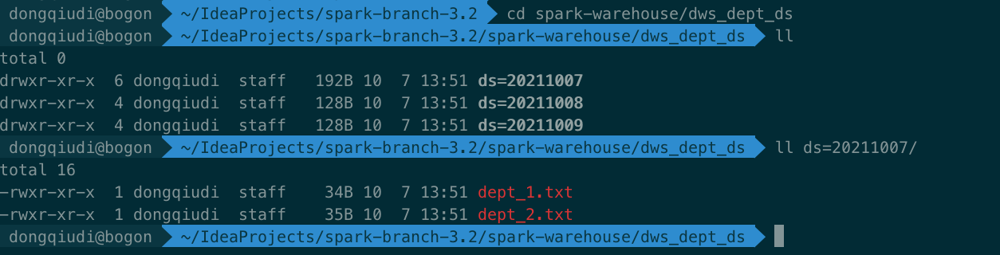
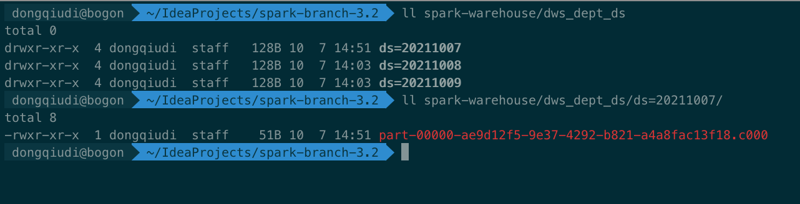

## 第一题： 如何避免小文件问题,给出2～3种解决方案

1. 针对Hive on Spark的情况下，可以使用参数控制合并文件  
> set hive.merge.sparkfiles=true;  
> set hive.merge.size.per.task=128000000;

2. 业务代码DataFrames使用coalesce()或者repartition()算子来实现输出文件数的控制  
> 要注意 coalesce()和repartition() 的区别
   
3. distribute by rand()控制输出文件数量且大小均匀 
> INSERT INTO TABLE partition_table PARTITION (date) select a,b,c from partition_json_table DISTRIBUTE BY date

4. AQE功能， Spark就会在计算过程中会实现部分程度的合并小文件
> spark.sql.adaptive.enabled = true  
> spark.sql.adaptive.coalescePartitions.enabled = true

5. SQL中使用REPARTITION
> INSERT INTO TABLE  SELECT /*+ REPARTITION(n) */ * FROM t

## 第二题：Compact table command

- 基本要求：COMPACT TABLE test1 INTO 500 FILES;
- 附加要求：如果添加partitionSpec，则只合并指定的partition目录的文件。
- 附加要求：如果不加into fileNum files，则把表中的文件合并成128MB大小。

### 第一步：sqlbase.g4文件中添加命令以及关键字
```shell
statement
    : query                                                            #statementDefault
    | COMPACT TABLE target=tableIdentifier partitionSpec?
        (INTO fileNum=INTEGER_VALUE identifier)?                       #compactTable
    ansiNonReserved
//--ANSI-NON-RESERVED-START
    : ADD
    | FILENUM
    nonReserved
//--DEFAULT-NON-RESERVED-START
    : ADD
    | FILENUM
```
 
### 第二步：创建visitCompactTable  

package org.apache.spark.sql.execution.SparkSqlParser
```scala

  /**
   * add by congpeixin
   * Compact Table Files
   * @param ctx the parse tree
   *    */
  override def visitCompactTable(ctx: CompactTableContext): LogicalPlan = withOrigin(ctx) {
    val table = visitTableIdentifier(ctx.tableIdentifier())
    val filesNum = if (ctx.INTEGER_VALUE() != null) {
      Some(ctx.INTEGER_VALUE().getText)
    } else {
      None
    }

    val partitionSpec = if (ctx.partitionSpec != null) {
      // According to the syntax, visitPartitionSpec returns `Map[String, Option[String]]`.
      visitPartitionSpec(ctx.partitionSpec).map {
        case (key, Some(value)) => key -> value
        case (key, _) =>
          throw new ParseException(s"Found an empty partition key '$key'.", ctx)
      }
    } else {
      Map.empty[String, String]
    }

    CompactTableCommand(table, filesNum, partitionSpec)
  }
```

### 第三步： 创建CompactTableCommand

```scala
case class CompactTableCommand(
                                table: TableIdentifier,
                                filesNum: Option[String],
                                partitionSpec: Map[String, String]) extends LeafRunnableCommand with Logging {

  override def run(sparkSession: SparkSession): Seq[Row] = {
    sparkSession.catalog.setCurrentDatabase(table.database.getOrElse("default"))
    sparkSession.conf.set("hive.exec.dynamici.partition", true)
    sparkSession.conf.set("hive.exec.dynamic.partition.mode", "nonstrict")
    // 指定表数据
    val originalDF = sparkSession.table(table.identifier)
    // 计算分区数
    val partitions = filesNum match {
      // 指定文件数  
      case Some(filenums) => filenums.toInt
      // 没有指定文件数，则根据逻辑计划来计算读取文件大小，使用ceil向上取整,保证分区数至少为1
      case None => (sparkSession.sessionState
        .executePlan(originalDF.queryExecution.logical)
        .optimizedPlan
        .stats
        .sizeInBytes.toLong./(1024.0)./(1024.0)./(128)).ceil.toInt
    }

    require(partitions > 0, s"Number of partitions ($partitions) must be positive.")

    logWarning("partitionSpec is  " + partitionSpec)
    logWarning("the repartition num is  " + partitions.toString)

    val builder = StringBuilder.newBuilder
    // 表分区参数判断逻辑
    if (partitionSpec.isEmpty) {
      // 如果没有指定表分区，则直接按照分区数进行 Overwrite 覆写
      originalDF.repartition(partitions)
        .write
        .mode(SaveMode.Overwrite)
        .insertInto(table.identifier)
      builder ++= s"COMPACT TABLE ${table.identifier} INTO ${partitions} FILES"
    } else {
      // 指定表分区
      val partitionKey = partitionSpec.head._1
      val partitionValue = partitionSpec.head._2
      
      originalDF.where(s"${partitionKey}='${partitionValue}'").repartition(partitions)
        .write
        .mode(SaveMode.Overwrite)
        .insertInto(table.identifier)

      builder ++= s"COMPACT TABLE ${table.identifier} " +
        s"partition(${partitionKey}='${partitionValue}') INTO ${partitions} FILES"
    }

    Seq(Row(builder.toString()))
  }
}
```

### 第四步： 打包编译 & 创建表和测试数据

- 打包编译
> ./build/sbt package -Phive -Phive-thriftserver -DskipTests  
>  
> tips: 编译过程中，scalastyle会有很多格式要求，包括引用的顺序，字符编码等，如果有调整不过去的红线，可以注释掉相应的要求 -_-   
> scalastyle-config.xml  
> scalastyle-on-compile.generated.xml

- 创建表和测试数据
```shell
CREATE TABLE `dws_dept_ds`(`dept_no` int,`addr` string,`tel` string) 
partitioned by (ds string) 
ROW FORMAT DELIMITED FIELDS TERMINATED BY ',';
```


- 表分区结构  
ds=20211007 分区下 两个文件  
ds=20211008 分区下 一个文件  
ds=20211009 分区下 一个文件  


### 第五步：执行命令 & 结果

- ds='20211007' 分区下的两个文件，合并成一个文件  
`COMPACT TABLE dws_dept_ds partition(ds='20211007') INTO 1 FILES;`


- 结果



- 不指定分区，合并表文件

`COMPACT TABLE dws_dept_ds INTO 1 FILES;`


- 结果

  
- 不指定文件数
  
`COMPACT TABLE dws_dept_ds;`

> 这个case 不指定文件数，则直接optimizedPlan取文件大小，除128MB, 直接overwrite覆写

